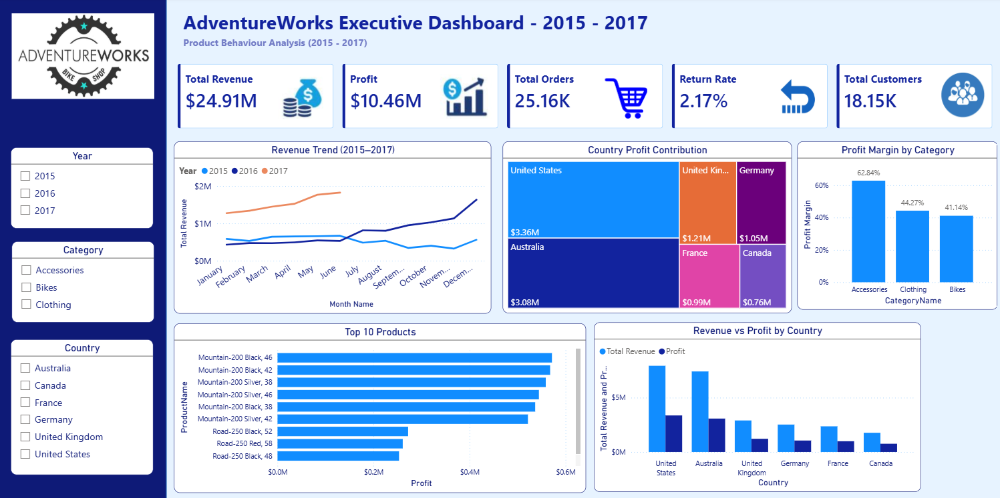

# 📊 AdventureWorks Executive Sales Dashboard (2015–2017)

> **An end-to-end Sales Analytics project built using Python, SQL, and Power BI to analyze three years of AdventureWorks sales data and deliver actionable business insights through an interactive executive dashboard.**

---

# 📌 Project Overview

The **AdventureWorks Executive Sales Dashboard** provides a comprehensive analysis of sales performance from **2015 to 2017**. The project demonstrates the complete analytics workflow, including **data cleaning and feature engineering using Python, business analysis using SQL, and interactive dashboard development in Power BI**.

The dashboard enables stakeholders to monitor revenue, profitability, customer performance, product trends, return rates, and country-wise sales through dynamic filters and KPIs.

---

# 🎯 Business Objectives

* Analyze sales performance across multiple years.
* Monitor revenue, profit, and order trends.
* Identify top-performing products.
* Compare sales and profitability across countries.
* Evaluate category-wise profit margins.
* Build an executive dashboard for business decision-making.

---

# 🛠️ Tech Stack

| Technology         | Purpose                                    |
| ------------------ | ------------------------------------------ |
| 🐍 Python (Pandas) | Data Cleaning & Feature Engineering        |
| 🗄️ MySQL          | Data Analysis & Advanced SQL Queries       |
| 📊 Power BI        | Dashboard Development & Data Visualization |
| 💻 Google Colab    | Python Development                         |
| 🌐 GitHub          | Project Documentation                      |

---

# 📂 Dataset

The project integrates multiple AdventureWorks datasets:

* 📅 Calendar
* 👥 Customers
* 📦 Products
* 🏷️ Product Categories
* 📁 Product Subcategories
* 🌍 Territories
* 🔄 Returns
* 💰 Sales (2015–2017)

### Dataset Summary

| Metric             |         Value |
| ------------------ | ------------: |
| Sales Transactions |    **25,164** |
| Customer Records   |    **18,148** |
| Product Records    |       **293** |
| Analysis Period    | **2015–2017** |

---

# Data Preparation (Python)

* Converted date columns to datetime format
* Cleaned missing and inconsistent values
* Merged multiple datasets
* Created customer age groups
* Calculated Unit Profit
* Generated Revenue and Profit metrics
* Created Inventory Lag feature
* Prepared analytical dataset for SQL and Power BI

---

# SQL Analysis

Implemented advanced SQL concepts including:

* JOIN Operations
* Aggregate Functions
* GROUP BY & ORDER BY
* Common Table Expressions (CTEs)
* Window Functions
* RANK()
* DENSE_RANK()
* Running Total Analysis

---

# 📈 Dashboard KPIs

| KPI                |       Value |
| ------------------ | ----------: |
| 💰 Total Revenue   | **$24.91M** |
| 💵 Total Profit    | **$10.46M** |
| 🛒 Total Orders    |  **25.16K** |
| 👥 Total Customers |  **18.15K** |
| 🔄 Return Rate     |   **2.17%** |

---

# 📊 Dashboard Features

* 📌 Executive KPI Cards
* 📈 Revenue Trend Analysis (2015–2017)
* 🌍 Country-wise Profit Contribution
* 📦 Top 10 Products by Profit
* 📊 Revenue vs Profit by Country
* 📉 Profit Margin by Category
* 🎛️ Interactive Filters (Year, Category & Country)

---

# 🔍 Key Business Insights

* 💰 Generated **$24.91M** in total revenue with **$10.46M** in total profit.
* 📈 Revenue increased from **$6.40M (2015)** to **$9.32M (2016)** before stabilizing in **2017 ($9.19M)**.
* 🌍 The dashboard highlights significant differences in regional revenue and profitability.
* 📦 Product profitability analysis identifies the highest-performing products to support inventory and sales strategies.
* 📊 Category-level profit margin analysis helps evaluate product category performance.
* 🔄 Return rate monitoring enables continuous tracking of product returns and operational efficiency.

---

# 📷 Dashboard Preview

---

# ⭐ Skills Demonstrated

* Python (Pandas)
* SQL
* Power BI
* Data Cleaning
* Feature Engineering
* Data Modeling
* Exploratory Data Analysis (EDA)
* Business Intelligence
* Dashboard Design
* KPI Reporting
* Data Visualization
* Window Functions
* Common Table Expressions (CTEs)

---

# Author

**Pranjali Sus**

Aspiring Data Analyst | Business Analyst | Power BI | SQL | Python | Excel

---

## ⭐ If you found this project useful, consider giving this repository a star!
